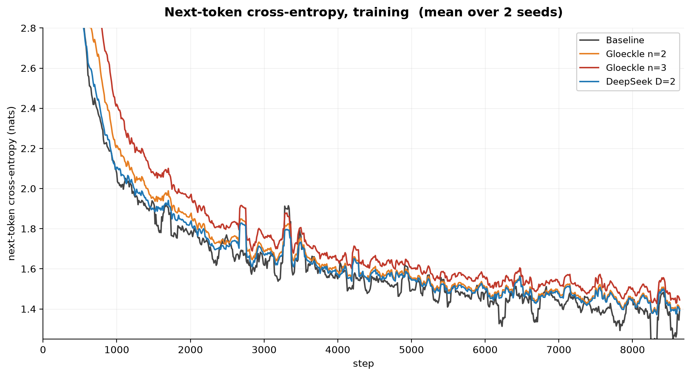
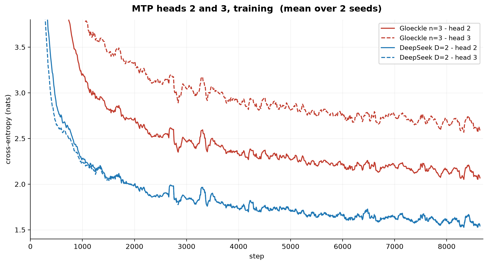
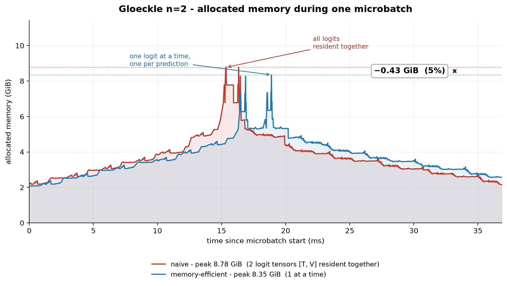
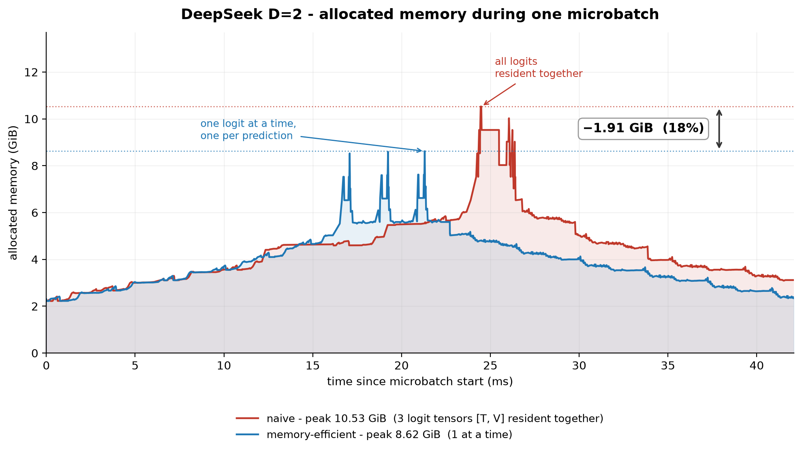

# MTP-TITAN

## Overview

This project integrates into torchtitan two Multi-Token Prediction variants, Gloeckle et al. (ICML 2024) and DeepSeek-V3 (§2.2). Both come with a memory-efficient version of the loss, which avoids keeping every head's logits in memory at once. The two models were trained at 57M parameters and compared against a baseline, and the resulting checkpoints were used to measure the speculative decoding speedup over autoregressive generation.

## Setup

This repo does not vendor torchtitan; it must be checked out separately at the pinned commit and installed in editable mode alongside this package:

```bash
git clone https://github.com/pytorch/torchtitan.git
git -C torchtitan checkout 2b78e1f0d4bd63b03cd93e839ed9897a7328679f
pip install -e torchtitan
pip install -r requirements-lock.txt
pip install -e .
```

## Code Guide

The training framework underlying the project is torchtitan, pinned to commit `2b78e1f0d4bd63b03cd93e839ed9897a7328679f`. The code was integrated as an external module, without touching the framework's own repo.

This was possible because torchtitan exposes a generic extension point: the `ConfigManager`
accepts any module path in `--module` and imports its `config_registry`. All the
code therefore resides in a separate package, `mtp_titan`.

The two MTP variants are subclasses of `Llama3Model`, the loss is a
subclass of `BaseLoss`, and the per-head metrics are a subclass of `MetricsProcessor`.

Runs are then launched simply with, for example:

```bash
MODULE=mtp_titan CONFIG=gloeckle_57m NGPU=1 ./run_train.sh

```

### architectures.py

In this script, the different models used for these experiments are defined:

* baseline: llama3 variant
* Gloeckle: shortened llama3 trunk, plus n parallel mtp heads, implemented as in Gloeckle et al. (ICML 2024)
* DeepSeek: shortened llama3 trunk, plus D sequential mtp modules, implemented as in DeepSeek-V3 §2.2

The sizes are in `SHAPES` (`debug`, `17m`, `57m`, `101m`): `dim` and `n_layers` are given, the
rest (`n_heads`, `hidden_dim`, parameter count) is derived. The experiments only use
`57m`.

`model_config()` builds a configuration for `Llama3Model`, thus usable for the baseline, and
then reused also to build the model configs of Gloeckle and DeepSeek. Both start from the dense config and slice its layers: `trunk_depth = L - n` for Gloeckle, `L - D` for DeepSeek, and the remaining blocks become the heads or modules. This convention, inspired by the paper by Gloeckle et al. (ICML 2024), is necessary to make the runs comparable.

`model_spec()` packages the config with `parallelize_fn` and `state_dict_adapter`, necessary for training.

### config_registry.py

In this script, the actual recipes for each run are found and built, all constructed starting from the `_recipe()` function which fixes everything that must remain the same across branches: optimizer, scheduler, data, global batch, validation, checkpoint, and metrics. Each variant has its wrapper, `_baseline()`, `_gloeckle()`, and `_deepseek()`, which change the `model_spec` and the loss.

Recipes are one function per experiment, and seed
(`baseline_57m`, `gloeckle_57m_n3`, `deepseek_57m_efficient`, the `..._seed1`, the `..._profile` for
profiling). Separate functions are needed because the `ConfigManager`
calls `config_fn()` without arguments.

### gloeckle.py

In this file is found the implementation of the classic MTP model (Gloeckle et al., ICML 2024). The `GloeckleModel` class, inheriting from `Llama3Model`, first uses the `trunk_hidden_states()` method, which simply iterates over the trunk layers until obtaining the hidden states; subsequently, the forward iterates over the mtp heads, producing the tuple of outputs. A fundamental method is `preprocess_inputs()`, which is largely analogous to the llama3 default, aside from labels management; in fact, to be able to calculate the MTP loss, each head has its label, which is shifted by 1 with respect to the previous head. The function that handles the computation of shifted labels is `mtp_labels()`, defined in `targets.py`.

### deepseek.py

In this file is found the implementation of the sequential MTP model (DeepSeek-V3 §2.2). The difference compared to Gloeckle is that the heads are not independent but sequential: each module receives the representation produced by the previous one, plus the embedding of the true future token. The `DeepSeekMtpModule` class implements a single prediction head, and is made of two `RMSNorm`s, an `M_k` projection (a `Linear` from `2d` to `d`), and a transformer block: the forward separately normalizes the input representation and the future token embedding, concatenates them, projects them with `M_k`, and passes the result to the block. The `DeepSeekModel` class, which like `GloeckleModel` inherits from `Llama3Model`, first calculates the trunk's hidden states, and then iterates over the modules reassigning `hidden_states` at each turn, which is exactly what makes the chain sequential; the future token embedding is obtained by shifting to the left the embeddings already calculated for the trunk. On each output, `decode()` is then called, which applies the final norm and the `lm_head`. `preprocess_inputs()` is identical to Gloeckle's and uses the same `mtp_labels()`.

In the file there is also `deepseek_head_weights()`, which builds the loss weights of eq. 25: 1 for the main model and λ/D for each depth.

### loss.py

In this script are found the two implementations of the MTP loss, both shared by the two variants. `MtpLoss` is the naive version, which can be shared by both MTP versions, since DeepSeek differs only in the way the loss terms are weighted.
Inside the class, a CE per-head accumulator is also defined, which serves to log them separately: the metrics dictionary that the loss returns is discarded by the trainer, so the passage occurs through this accumulator, which `MtpMetricsProcessor` drains at each logging. The accumulated CEs are always the raw ones, never weighted, otherwise the CE of head 1 would no longer be comparable with the baseline.

`MtpMemoryEfficientLoss` is the Gloeckle §2 version, the one that avoids keeping all the logits in memory together, doing forward and backward individually on each head, accumulating the gradient. It inherits from `ChunkedLossWrapper` purely for a practical reason: the trainer recognizes that type and takes care on its own of calling `set_lm_head()` and putting `_skip_lm_head` on the model, which thus returns hidden states instead of logits. The loss then cycles over the heads, and for each applies the `lm_head`, computes the CE, immediately does the backward and accumulates the gradient with respect to the head's input: at that point the logits of that head can be freed before passing to the next. The collected gradients are finally returned to the model by `_HeadGradientBridge`, a custom `torch.autograd.Function` whose forward does nothing and whose backward limits itself to delivering the already calculated gradients. It is needed because the heads share the trunk's graph: n separate backwards would traverse it n times, and PyTorch would stop at the second round.

### targets.py

Contains the previously mentioned labels shifting function. Besides handling the shifting, it also manages the masking of cross-document positions, so as to avoid the mtp head loss being calculated on tokens belonging to the next sequence.

### speculative.py

In this script is found the implementation of self-speculative decoding, i.e., the use of MTP predictions as drafts to be verified. `greedy_decode()` is the reference version, one forward per token, and serves both as a comparison and as an oracle for the T8 test. `speculative_decode()` is the true loop: at each iteration it does a single forward, which serves simultaneously to verify the tokens drafted in the previous round and to produce those of the next round. The verification lies in `accepted_prefix_length()`, which compares the drafted tokens with those that the greedy would have produced.

Drafting is the only part that changes between the two variants, and is found in two classes with the same interface, chosen by `make_drafter()`. For the `GloeckleDrafter` the heads are independent, so the model's normal forward already contains all the needed predictions and the draft is a simple indexing. `DeepSeekDrafter` instead must reconstruct the chain by hand, because the embedding of the true future token is needed, which in inference does not exist yet; the chain is then fed with its own predictions, overwriting the last rows of the shifted embeddings with the newly drafted tokens. `DecodeStats` finally keeps record of the statistics: tokens per forward and acceptance rate.

### metrics.py

`MtpMetricsProcessor` is a subclass of `MetricsProcessor` which, at each logging, drains the `MtpLoss` accumulator and adds the CEs per head to the metrics, both training and validation. It also names the wandb runs, derived from the recipe name.

### profiler.py

A subclass of the profiler that enables memory tracking: torchtitan does not expose `profile_memory` as a config field, so it is turned on here.

## Experiment Runs

Given time and GPU budget constraints, models were trained with 57M non-embedding parameters, a very small scale but one that should still give interesting signals to study the phenomenon. To keep embedding parameters from dominating the parameter count, the Llama3 tokenizer was not used; instead, a BPE tokenizer with a vocabulary of 16384 tokens was trained, with tied embeddings. The baseline architecture is therefore a Llama3, with 8 layers, `dim=768`, `n_heads=12`, `head_dim=64`, FFN hidden 2048 and a context of 2048 tokens, for a total of 56.64M non-embedding parameters plus 12.58M shared embeddings. A deliberate deviation compared to llama3 concerns RoPE, which here uses `theta=10000` and no scaling: llama3's scaling serves to extend the context of a pre-trained model to 8k, and it would make no sense on a model trained from scratch to 2048. The MTP variants, to maintain a number of parameters comparable to the baseline, for each transformer block used for an mtp head, have one layer removed from the trunk.

As for data, a single code corpus was used, Starcoderdata, restricted to Python, to simplify the task and reduce noise at this scale. The experiments used 1.13 billion tokens, i.e. 8641 steps of 131072 tokens each; this choice follows the Chinchilla-optimal standard, for two reasons: to avoid an extremely undertrained model, and to minimize the loss given the limited compute budget available. Each experiment was also run with two different seeds, to keep noise down.

All experiments used a single Nvidia RTX A6000.

Below are presented the training loss curves of the experiments, in a comparable way, that is comparing the CE of the baseline, with the CEs of the first prediction head of the MTP variants. Each curve is the average over the two seeds.



From the curve it is possible to notice:

1. The baseline loss is slightly lower throughout the whole training, compared to the MTP variants.
2. Regarding the Gloeckle variant, it appears evident that increasing the number of prediction heads (and consequently reducing the trunk layers), has degraded the loss.
3. the loss of the DeepSeek variant with D=2, which thus makes 3 predictions in total, is even slightly better than the loss of the Gloeckle variant with n=2, which makes only 2 predictions; it seems therefore that the DeepSeek variant, for the same number of predictions, degrades the next-token loss less than the Gloeckle variant.

Below are presented the training losses of prediction heads 2 and 3, for the Gloeckle n=3 and DeepSeek D=2 runs.



To note that:

1. Gloeckle's head 3 has a significantly higher loss than head 2 of the same run; this suggests that for Gloeckle, the loss scales negatively with the distance of the prediction head from the base one.
2. The DeepSeek variant, at least from these runs, does not seem to suffer the same degradation. This could be easily explained, given that, in the DeepSeek variant, the mtp modules receive as input the true future token embedding (teacher forcing, eq. 21), so each head solves an easier problem than the corresponding Gloeckle head, which has to reach t+k from position t alone.

| Experiment | Non-emb params | Predictions | Val next-token CE | Val PPL | Val CE @ k=2 | Val CE @ k=3 | tok/s | MFU | Peak allocated |
| --- | --- | --- | --- | --- | --- | --- | --- | --- | --- |
| Baseline | 56.64M | 1 | **1.3477** | 3.849 | — | — | 111,917 | 40.9% | 7.73 GiB |
| Gloeckle n=2 | 56.64M | 2 | **1.3928** | 4.026 | 2.0403 | — | 93,390 | 34.2% | 8.35 GiB |
| Gloeckle n=3 | 56.64M | 3 | **1.4382** | 4.213 | 2.0712 | 2.6045 | 82,182 | 30.1% | ~8.40 GiB |
| DeepSeek D=2 | 59.00M | 3 | **1.3831** | 3.987 | 1.5432 | 1.5523 | 80,438 | 30.2% | 8.62 GiB |

The results table seems to confirm the previous observations.

* The baseline has the lowest next-token validation loss and perplexity; it seems therefore that, at this scale, the use of some layers as MTP heads degrades the model's performance. This is aligned with what is reported in Gloeckle et al., where the same phenomenon is highlighted for models with fewer than 3B parameters.
* The DeepSeek variant in terms of quality wins over Gloeckle, and, given the same number of predictions (Gloeckle n=3 and DeepSeek D=2), is on par in terms of training efficiency.
* All mtp variants report an overhead, both in terms of throughput and memory peak, compared to the baseline.

## Profiling

For each experiment, a profiling run was also performed, using the torch profiler. Memory profiling was fundamental to monitor the actual functioning of the memory-efficient versions of the two MTP variants.

The following two figures compare, for Gloeckle and for DeepSeek, the memory actually allocated during a microbatch between the naive version and the memory-efficient one. The curves are aligned at the start of the microbatch and clearly show the mechanism: the naive one keeps all heads' logits in memory together, while the memory-efficient one materializes them one at a time.





## Speculative Decoding

The resulting models from the experiment runs were also tested in inference on speculative decoding, to understand how much they manage to speed up compared to the baseline.

Note that a naive inference and spec-dec script was written, which is very far from the standard of inference frameworks (for example, KV-caching is not performed). Its purpose must be considered exclusively as a dummy test.

Measured with `scripts/benchmark_speculative.py` on 5 Python
prompts × 128 generated tokens, batch size 1, one A6000.

| Experiment | Drafted tokens | Acceptance @1 | Acceptance @2 | Tokens per forward | tok/s |
| --- | --- | --- | --- | --- | --- |
| Baseline | 0 | — | — | 1.000 | 152.5 |
| Gloeckle n=2 | 1 | 91.3% | — | 1.893 | 309.7 |
| Gloeckle n=3 | 2 | 83.3% | 77.6% | 2.550 | 416.4 |
| DeepSeek D=2 | 2 | 90.0% | 86.6% | 2.712 | 416.2 |

From these results it can be observed that:

1. all mtp models actually have good acceptance rates, and guarantee substantial speedups.
2. the DeepSeek variant, also in this case, proves slightly superior, presenting better acceptance rates, and a better number of tokens per forward. Despite this, the tok/s are practically equal between Gloeckle n=3 and DeepSeek D=2; it must be considered, however, that, as previously pointed out, this is just a dummy inference benchmark, and the tok/s could be a noisy measure, and dominated by other bottlenecks that do not concern speculative decoding per se.

## Testing

* **T1**: with a single prediction, MTP must reproduce the baseline bit for bit (loss and gradients), both for Gloeckle and for DeepSeek: verifies that the integration does not alter the dense path.
* **T2**: building a Gloeckle model must have no side effects on the baseline path.
* **T3**: causality: the loss gradient on a future prediction with respect to a subsequent input must be exactly zero.
* **T4**: target alignment: prediction k must read the correct shift and zero out at segment boundaries, without the classic off-by-one.
* **T5**: the memory-efficient loss must give identical loss and gradients to the naive one.
* **T6**: the last k positions of each segment, without targets for prediction k, must not count in the loss normalization.
* **T8**: the verified output of the speculative decoding must match token by token with the greedy one, for both variants.
* **T9**: basic hygiene: shape, dtype, determinism, saving and reloading the checkpoint.
* **T10**: faithfulness to the DeepSeek-V3 §2.2 spec: M_k shape, shared embedding and output heads, sequential chain, λ/D loss weights.

## Conclusion

In conclusion, although this project cannot be exhaustive, in particular due to the limited scale of the experiments, some important observations have nevertheless been drawn.

First of all, comparing the two MTP variants, the DeepSeek version appears to have an advantage on all fronts: the model's loss and perplexity are lower compared to Gloeckle, and the speculative decoding performance reports a better acceptance rate and number of tokens per forward; finally, in terms of training efficiency, the two variants proved to be on par, given the same number of predictions.

Instead, regarding the comparison against the baseline, it emerged that both MTP variants can lead to a degradation of the next-token loss and perplexity. It should be noted however, that this could depend on the too small scale of the experiments; in fact, the same phenomena were noted in Gloeckle et al. on models under 3B parameters. In terms of training efficiency, MTP slowed down the training, decreasing throughput and MFU; this however, in real cases, is probably solvable with the implementation of specific optimized kernels. Finally, the great advantage of MTP demonstrated already at this scale concerns the speeding up of inference; in fact, both variants have proven capable of acting as drafters for speculative decoding, reaching up to 2.7 tokens per forward.
